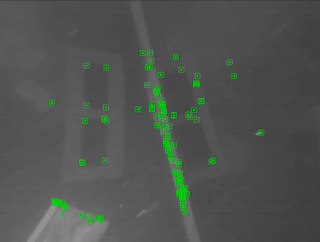
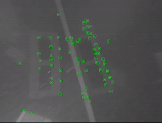
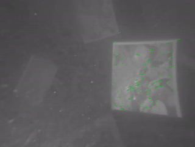
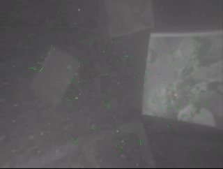

# UFEN-SLAM
Paper: **Knowledge Distillation for Feature Extraction in Underwater VSLAM (ICRA 2023)** [ArXiv](https://arxiv.org/abs/2303.17981) or [IEEE](https://ieeexplore.ieee.org/document/10161047)

## 1. Introduction

UFEN is an underwater feature extraction and matching network.
We use in-air RGBD data to generate synthetic underwater images and employ these as the medium to distil knowledge from a teacher model [SuperPoint](https://github.com/magicleap/SuperPointPretrainedNetwork).

Refer to [GCNv2](https://github.com/jiexiong2016/GCNv2_SLAM), We embed UFEN into the [ORB-SLAM3](https://github.com/UZ-SLAMLab/ORB_SLAM3) framework to replace the ORB feature. The code of UFEN-SLAM will be public shortly.

We also built a new underwater dataset in different water turbidities with groundtruth measurements named EASI.
The EASI dataset can be found in [EASI Dataset](https://github.com/Jinghe-mel/UFEN-SLAM/tree/main/EASI%20Dataset).

## 2. Demo

Tracking Loss (ORB-SLAM3 VS UFEN-SLAM)

 

Initialization Failure (ORB-SLAM3 VS UFEN-SLAM)

 

## 3. UFEN feature matching implementation
The fast implementation code of UFEN feature matching is public in [UFEN_Demo](https://github.com/Jinghe-mel/UFEN-SLAM/tree/main/UFEN_Demo).
The original weight can be found in [SuperPoint](https://github.com/magicleap/SuperPointPretrainedNetwork).
The weights of UFEN can be downloaded in [EASI Dataset](https://github.com/Jinghe-mel/UFEN-SLAM/tree/main/EASI%20Dataset).

## 4. UFEN-SLAM
The code of UFEN-SLAM will be public shortly.

## Citation

Please cite our papers if you use the EASI dataset or the UFEN. 
```
@INPROCEEDINGS{10161047,
  author={Yang, Jinghe and Gong, Mingming and Nair, Girish and Lee, Jung Hoon and Monty, Jason and Pu, Ye},
  booktitle={2023 IEEE International Conference on Robotics and Automation (ICRA)}, 
  title={Knowledge Distillation for Feature Extraction in Underwater VSLAM}, 
  year={2023},
  doi={10.1109/ICRA48891.2023.10161047}}
```
